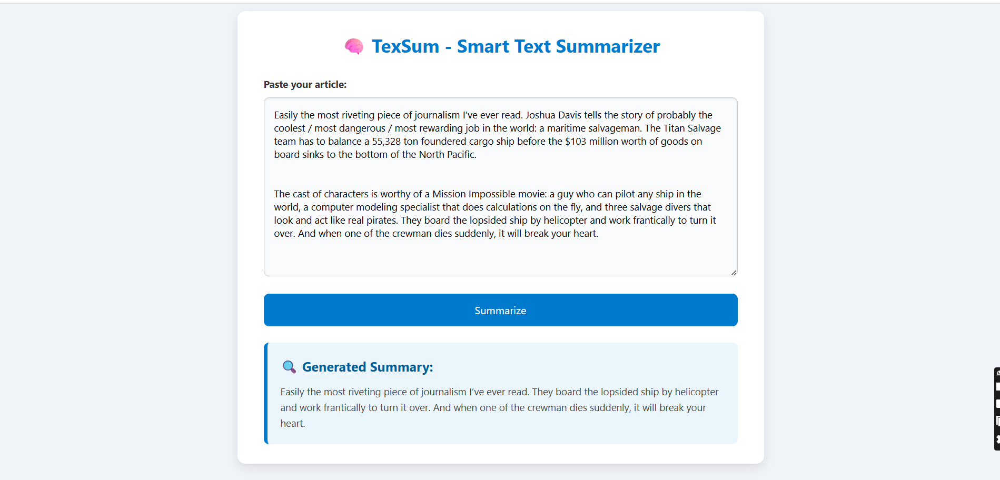

# 🧠 TEXT SUMMARIZATION TOOL – TexSum (Flask Web App)

A smart and professional tool for summarizing long articles, built using **Flask**, **Python**, and **Natural Language Processing**. This web app allows users to input large chunks of text and instantly receive a clean, meaningful summary using extractive summarization (LSA).

---

## 🏢 INTERNSHIP DETAILS

- **COMPANY**: CODTECH IT SOLUTIONS  
- **NAME**: JEMIMAH PRAISY  
- **INTERN ID**: CT04DG2504  
- **DOMAIN**: ARTIFICIAL INTELLIGENCE  
- **DURATION**: 4 WEEKS  
- **MENTOR**: NEELA SANTHOSH  

---

## ✨ FEATURES

- 📝 Input any long article or document
- 🧠 Automatic summary using LSA (Latent Semantic Analysis)
- 💡 Clean and elegant UI with a responsive design
- 🌐 Built using Flask, HTML, CSS, and Python
- 📄 Summary output updates instantly upon form submission

---

---

## 📷 OUTPUT PREVIEW

Below is a sample output from the TexSum summarizer web app:

---

